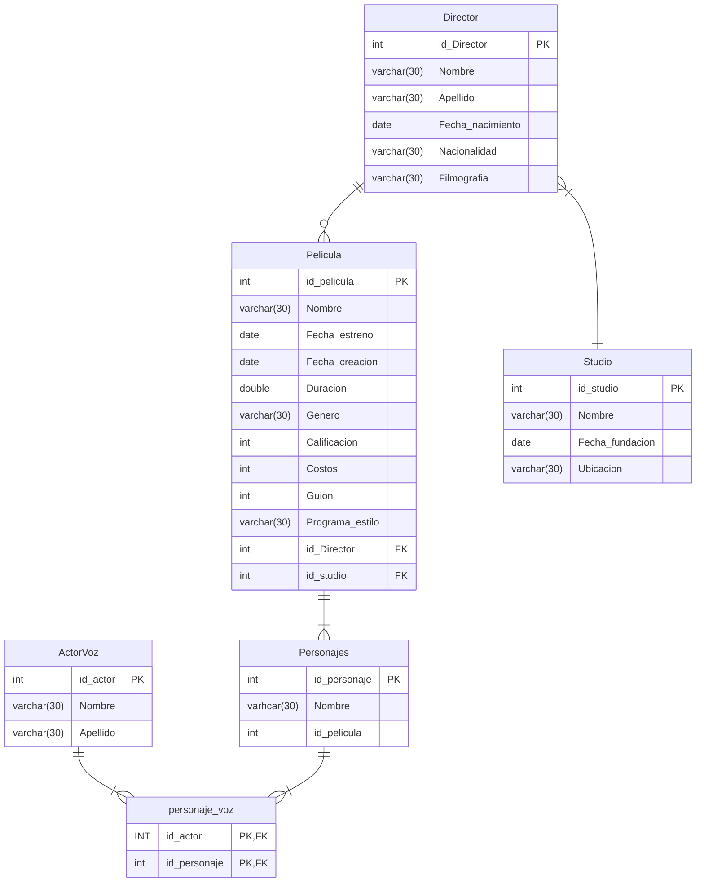
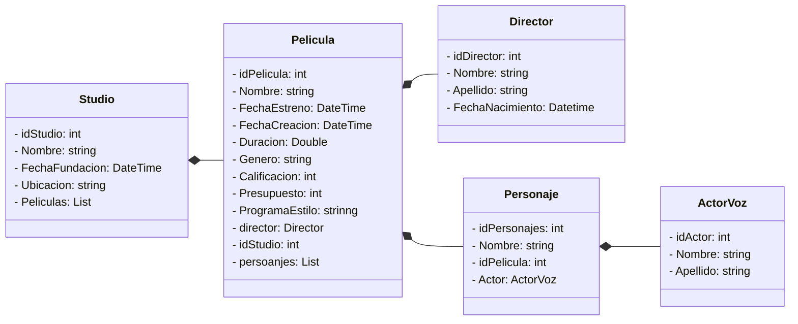

# Diagrama de BD 

```mermaid
  erDiagram
  
  Director{
    int id_Director PK
    varchar(30) Nombre
    varchar(30) Apellido
    date Fecha_nacimiento
    varchar(30) Nacionalidad
    varchar(30) Filmografia
  }


  Pelicula{
    int id_pelicula PK
    varchar(30) Nombre
    date Fecha_estreno
    date Fecha_creacion
    double Duracion
    varchar(30) Genero
    int Calificacion
    int Costos
    int Guion
    varchar(30) Programa_estilo
    int id_Director FK 
    int id_studio FK
  }


  Studio{
    int id_studio PK
    varchar(30) Nombre
    date Fecha_fundacion
    varchar(30) Ubicacion
  }


  ActorVoz{
    int id_actor PK
    varchar(30) Nombre
    varchar(30) Apellido
  }
  personaje_voz{
    INT id_actor PK,FK
    int id_personaje PK,FK
  }


  Personajes{
    int id_personaje PK
    varhcar(30) Nombre
    int id_pelicula
  }

  Director ||--o{ Pelicula:""
  Director }|--|| Studio:""
  Pelicula ||--|{ Personajes:""
  ActorVoz ||--|{ personaje_voz:""
  Personajes ||--|{ personaje_voz:""


```

### Diagrama de Clases UML

```mermaid
  classDiagram
direction RL

class Director{
-  idDirector: int
- Nombre: string
- Apellido: string
- FechaNacimiento: Datetime
}

class Studio{
- idStudio: int
- Nombre: string
- FechaFundacion: DateTime
- Ubicacion: string
- Peliculas: List<Pelicula>
}

class ActorVoz{
- idActor: int
- Nombre: string
- Apellido: string
}

class Personaje{
- idPersonajes: int
- Nombre: string
- idPelicula: int
- Actor: ActorVoz
}

class Pelicula{
- idPelicula: int
- Nombre: string
- FechaEstreno: DateTime
- FechaCreacion: DateTime
- Duracion: Double
- Genero: string
- Calificacion: int
- Presupuesto: int
- ProgramaEstilo: strinng
- director: Director
- idStudio: int
- persoanjes: List<Personaje>
}

Director --* Pelicula
Pelicula --* Studio
Personaje --* Pelicula
ActorVoz --* Personaje

```